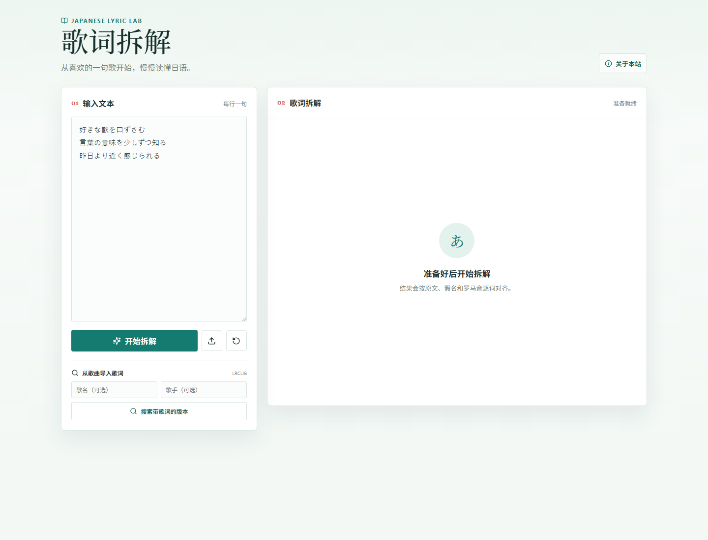
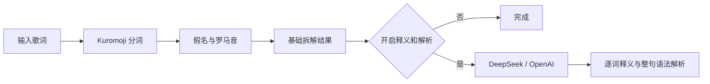

# Japanese Lyric Lab

> 给日语歌词加上逐词切分、假名、罗马音，以及可选的 AI 释义与语法解析。

[](https://github.com/Domii17/Japanese-lyric-lab/actions/workflows/ci.yml)
[](LICENSE)



## 它能做什么

| 功能 | 是否需要 AI |
| --- | --- |
| 日语分词、原形和词性 | 否 |
| 平假名与罗马音 | 否 |
| 数字读音与常见异体字处理 | 否 |
| TXT 文件导入 | 否 |
| LRCLIB 歌词搜索 | 否 |
| 逐词释义 | 是 |
| 整句翻译与语法解析 | 是 |
| 选择句子导出 PNG | 否 |

基础拆解不依赖 AI。没有配置 API Key 时，网站仍可正常使用。

## 第一次本地运行

如果你只是想使用网站，**需要先把这个 GitHub 项目克隆到自己的电脑**，再在项目文件夹里启动它。最适合新手的流程是：

1. 安装 [Node.js 20 LTS 或更高版本](https://nodejs.org/)。安装程序一路保持默认选项即可。
2. 安装 [GitHub Desktop](https://desktop.github.com/)，打开本仓库页面，点击 **Code → Open with GitHub Desktop**，选择本地保存位置并点击 **Clone**。
3. 在 GitHub Desktop 点击 **Repository → Open in PowerShell**（或在项目文件夹空白处右键选择“在终端中打开”）。
4. 在打开的终端中依次运行：

   ```powershell
   corepack enable
   pnpm install
   pnpm dev
   ```

5. 看到 `Ready` 后，在浏览器打开 [http://localhost:3000](http://localhost:3000)。终端窗口需要保持打开，关闭它网站就会停止。

完整图文说明和常见报错处理见[本地运行与部署指南](docs/deployment.md)。

## 开启 AI

AI 只在自行部署时启用。以DeepSeek为例：

```powershell
Copy-Item .env.example .env.local
```

```env
AI_FEATURE_ENABLED=true
AI_PROVIDER=deepseek
DEEPSEEK_API_KEY=你的_API_Key
DEEPSEEK_MODEL=deepseek-chat
```

保存后重启 `pnpm dev`，页面会出现“释义和解析”开关。

> API Key 只在服务端读取，不会发送给浏览器；不要把 `.env.local` 提交到 GitHub。

## 工作方式



## 部署

推荐使用 Vercel：

1. Fork 本仓库。
2. 在 Vercel 导入项目。
3. 不配置 AI 变量即可运行基础版。
4. 在 Vercel 环境变量中配置API，即可启用高级解析。

详细文档：

- [AI 配置](docs/ai-configuration.md)
- [Vercel 部署](docs/deployment.md)
- [隐私与版权](docs/privacy-and-copyright.md)
- [常见问题](docs/troubleshooting.md)

## 项目状态

这是一个面向日语初学者的个人开源项目。歌词由用户输入或第三方服务临时提供，项目不附带完整受版权保护歌词，也不建立用户数据库。

代码采用 [MIT License](LICENSE)。

## 贡献与安全

- 贡献流程：[CONTRIBUTING.md](CONTRIBUTING.md)
- 安全问题：[SECURITY.md](SECURITY.md)
